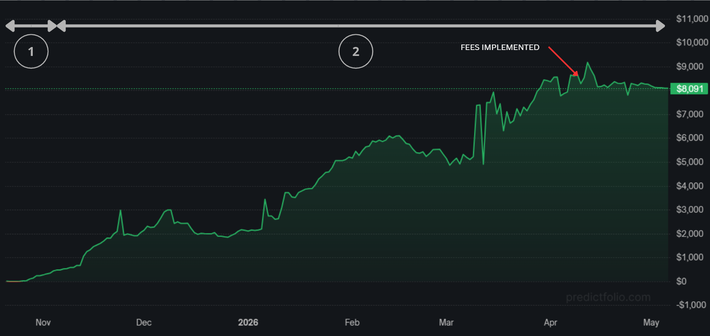
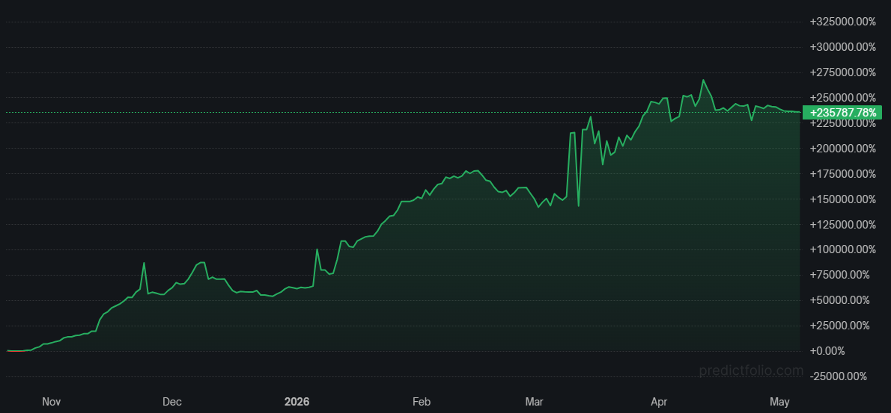
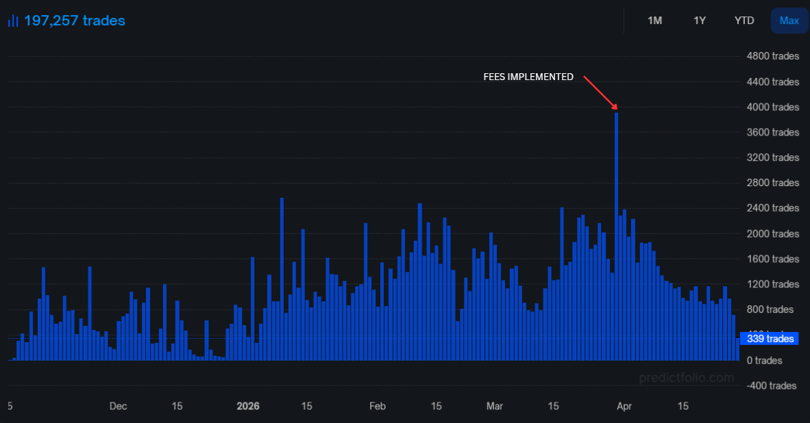

# Results — Polymarket Market Maker

## Summary

Running since November 2024. Consistently top 1% of Polymarket traders by PnL and volume. ~2,000 transactions per day on average across the bot's lifetime.

---

## Graphs

### PnL over time

*Cumulative PnL from November 2024 to present, starting from an initial deposit of $10.*

- **① Manual phase** — I was applying the strategy by hand, placing orders individually to validate the approach before building the bot.
- **② Automated phase** — the bot takes over, quoting ~2,000 markets simultaneously. The slope increases immediately and stays consistent until taker fees are introduced (labeled on the chart), after which daily volume drops but PnL continues growing.

The % return graph below reflects the same journey — the numbers look extreme (thousands of percent) because of the $10 starting capital, not because of outsized risk-taking.

---

### PnL over time (% return)

*Same data as above expressed as % return on initial $10 deposit. The scale reflects the small starting capital.*

### Daily transaction count

*Number of fills per day. The drop-off after taker fee introduction is clearly visible. The bot continues placing orders daily.*

---

## Platform ranking

Top 1% by PnL and by total volume among all Polymarket traders. These metrics are visible on the Polymarket leaderboard.

---

