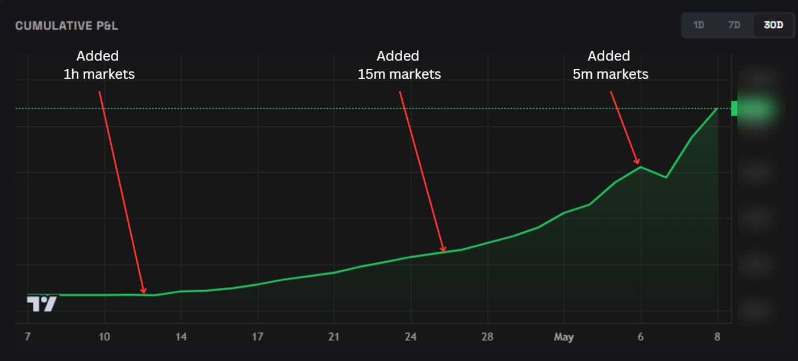
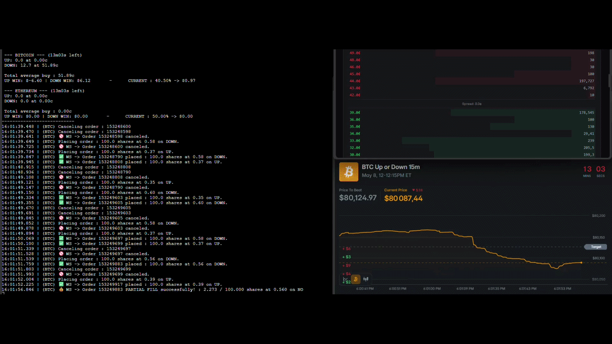

# Results : PredictFun Bitcoin Market Maker

## Summary

Three distinct performance phases, each clearly visible in the PnL graph. The biggest step-changes were adding 15-minute markets and 5-minute markets.

---
## PnL over time 

*Cumulative PnL with three milestones: launch with 1h markets, 15min markets added,  5min markets*

---

## Live bot demo

> V4 (high volume):
> 
> Demo May 19, 14:15-14:45PM : https://youtu.be/IPtrwNjbwbg

> V3 (low volume):
> 
> Demo May 8, 11:30-11:45AM : https://youtu.be/XrqKRJo7mww
> 
> Demo May 8, 11:45-12:00PM : https://youtu.be/HOqg1OsMmms
> 
> Demo May 8, 12:00-12:15PM : https://youtu.be/iI1MEIVWExI
> 

---

## How to read the console

The console is split into two sections: a position summary at the top, and a
live order log below. It refreshes continuously as Bitcoin moves and orders are placed.
Also included the market order book and bictoin price.

---

### Position summary

The top section shows the current state of the bot's position for each active market
(Bitcoin, and any other assets being traded).

**Market header**

Shows the asset and the time remaining until the current market resolves. Each market
has a fixed duration, when it expires, all shares pay out based on whether Bitcoin
closed up or down.

**Up and Down shares**

The bot holds shares on both sides of the market simultaneously. For each side it
tracks how many shares are held and the average price paid per share. Each share pays
out $1 if that side wins and $0 if it loses.

**Total average buy**

The combined average cost across both sides, expressed in cents per $1 of total payout.
The goal is to keep this below $1. If the bot buys $1 of potential payout for less
than $1 on average, the position has positive expected value by construction. Lower is
better.

**Up win / Down win**

The PnL the bot would realize if the market resolves in each direction. When both
values are positive, the position is fully hedged, the bot profits regardless of
which way Bitcoin moves. When one side is negative, the bot is temporarily imbalanced
and will rebalance as new maker orders fill on the weaker side.

**Current expected PnL**

The probability-weighted average of the two outcomes:

$$\text{Expected PnL} = \text{Up win} \times P(\text{Up}) + \text{Down win} \times (1 - P(\text{Up}))$$

$P(\text{Up})$ is computed in real time using Black-Scholes with the current Bitcoin
price and implied volatility extracted from Polymarket. This number represents the
bot's best estimate of what the position is worth right now.

---

### Order log

The lower section is a timestamped stream of every action the bot takes, with
millisecond precision.

**Order placed**

A new limit order submitted to PredictFun's order book, showing the side (up or down),
price, and quantity.

**Canceling order**

As Bitcoin price moves, the bot cancels stale orders immediately before they can be filled at the wrong price.

**Partial fill**

A taker crossed the spread but only took part of the order. For example, an order for
100 shares might be partially filled in several increments : 2.5 shares, then 16.7
shares, as different takers hit it at different moments. The order remains live on
the book for the remaining quantity until it is either fully filled or canceled.

**Full fill**

The entire order was taken. The bot now holds those shares as a maker position and
will work to accumulate the opposite side to hedge the exposure.

Partial fills are common, most orders are large enough that a single taker rarely
takes the full quantity in one go. The bot tracks the filled quantity in real time via
WebSocket and factors the new position into the expected PnL calculation immediately.
